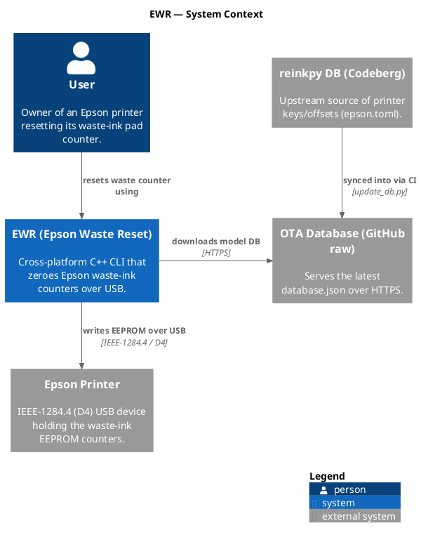
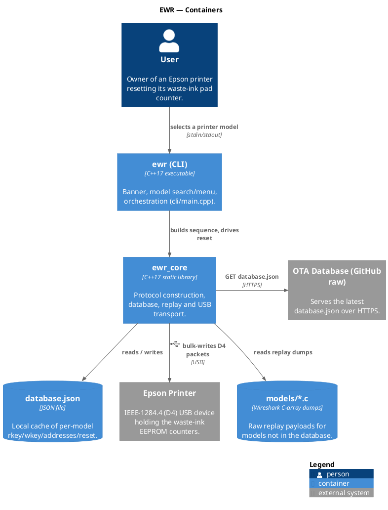
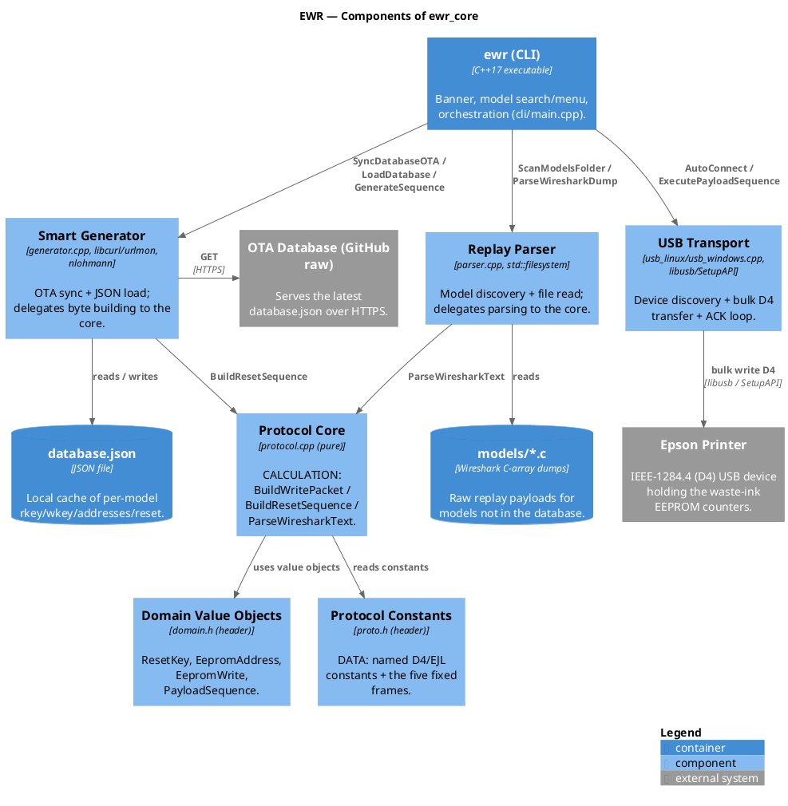
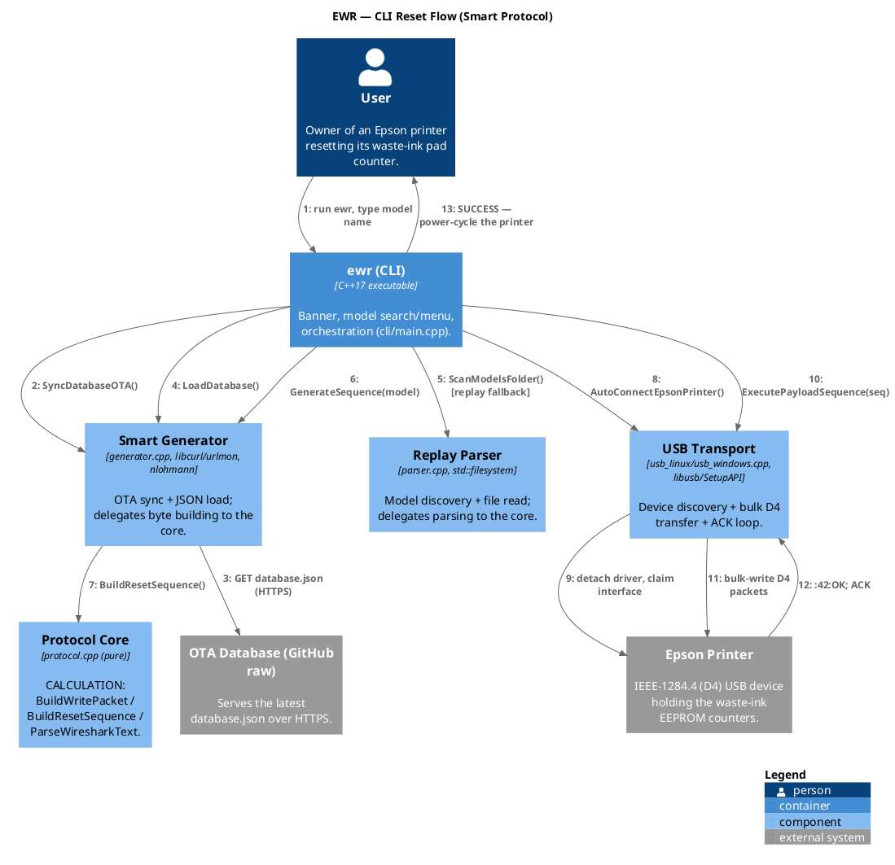

# EWR Architecture

EWR turns a printer model into a byte-exact IEEE-1284.4 (D4) USB conversation
that zeroes the waste-ink EEPROM counters. The code is organized as three
strata; every dependency points **downward**.

## Diagrams (C4)

Generated from the [Overarch](https://github.com/soulspace-org/overarch) model in
[`arch/`](arch/) (`overarch` → PlantUML → PNG). To regenerate, see
[`arch/README.md`](arch/README.md).

### Level 1 — System Context

### Level 2 — Containers

### Level 3 — Components of `ewr_core`

The pure core (`proto` / `domain` / `protocol`) sits at the bottom; the I/O
components delegate *into* it — the data → calculation → action spine, drawn.

### Dynamic — CLI reset flow (runtime)

## Layers (data → calculation → action)

| Stratum | Rule | Lives in |
|---|---|---|
| **DATA** | constants and value objects; no logic | `include/ewr/proto.h`, `include/ewr/domain.h` |
| **CALCULATION** | pure functions; no I/O, no globals, no logging | `include/ewr/protocol.h`, `src/protocol.cpp` |
| **ACTION** | the only code that touches USB / HTTP / filesystem / console | `src/usb_*.cpp`, `src/generator.cpp` (OTA + JSON), `src/parser.cpp` (file read), `cli/main.cpp` |

The four principle frameworks the refactor follows converge on this one shape:
Stratified `data + calculation` == CPPB *pure pipeline* == DDD *domain* == the
SOLID SRP-extracted core.

## Module map

- **`include/ewr/proto.h`** — named D4/EJL protocol constants + the five fixed
  frames (EJL init, D4 init, open-channel, credit grant/request).
- **`include/ewr/domain.h`** — value objects `ResetKey`, `EepromAddress`,
  `EepromWrite`, and the `D4Packet` / `PayloadSequence` aliases.
- **`include/ewr/protocol.h` + `src/protocol.cpp`** — the pure core:
  `BuildWritePacket`, `BuildResetSequence`, `ParseWiresharkText`.
- **`src/generator.cpp`** — Smart path I/O (OTA download, JSON load); delegates
  byte building to the core.
- **`src/parser.cpp`** — Replay path I/O (model discovery + file read);
  delegates parsing to the core.
- **`src/usb_linux.cpp` / `src/usb_windows.cpp`** — transport: device discovery,
  bulk transfer, ACK loop.
- **`cli/main.cpp`** — composition + interactive menu.
- **`database.json` / `models/*.c`** — data (synced by `scripts/update_db.py`).

## The write packet (safety-critical)

`BuildWritePacket` emits, in order: a D4 header (`02 02`, **big-endian** total
length, credit `00`, control `00`), the Epson `7C 7C` frame with a
**little-endian** inner length, then `[rkey_LE, 0x42, ~0x42=0xBD,
rotr1(0x42)=0x21, addr_LE, value, wkey…]`. The endianness asymmetry, the zero
credit, and the checksum bytes are load-bearing — see
[REFACTOR_ROADMAP.md](REFACTOR_ROADMAP.md) for the full invariant list. Every
byte is pinned by `tests/golden_test.cpp`.

## Extending

- **New printer model:** add it upstream (reinkpy DB, auto-synced) or drop a
  Wireshark `models/<NAME>.c` dump (Replay path) — no code needed.
- **New transport (e.g. macOS):** implement device discovery + bulk transfer;
  the roadmap's P3 introduces an `ITransport` seam for exactly this.

See also: [TESTING.md](TESTING.md), [REFACTOR_ROADMAP.md](REFACTOR_ROADMAP.md).
